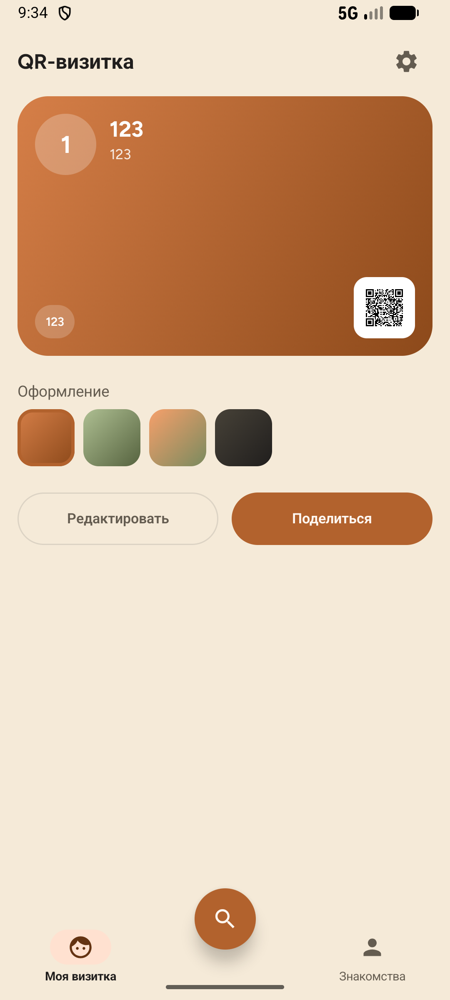
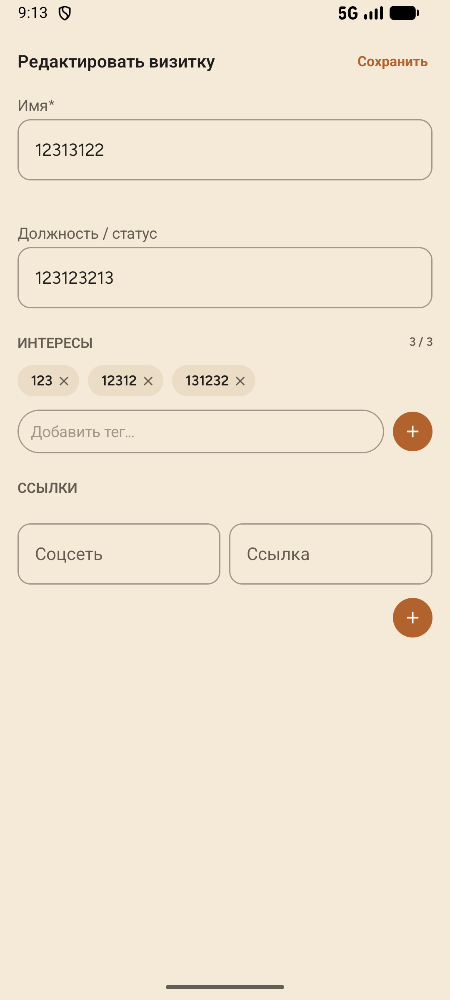
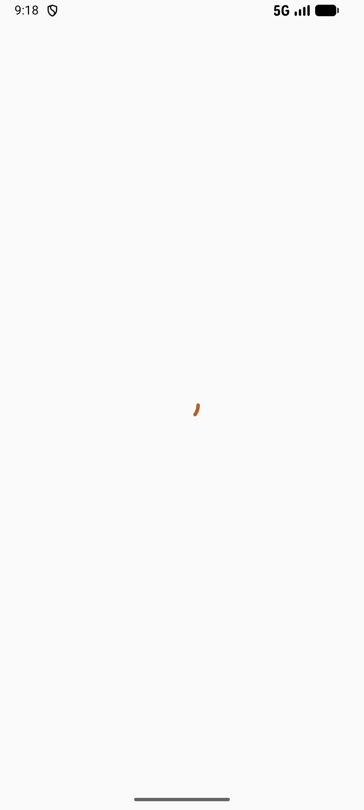
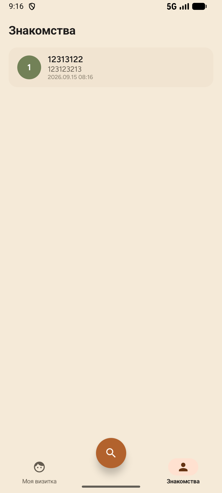

# Visit — QR-визитка


Android-приложение для нетворкинга на офлайн-мероприятиях: цифровая визитка с QR-кодом, сканер визиток других людей и история знакомств.

<p align="center">
  
  
  
  
</p>
<p align="center">
  <sub>Моя визитка · Редактирование · Сканер · Знакомства</sub>
</p>

## Стек

- **Kotlin**, **Jetpack Compose** (Material 3), Navigation Compose с типобезопасными маршрутами
- **MVVM + Clean Architecture**: presentation / domain / data
- **Hilt** — DI
- **Room** — локальное хранилище отсканированных контактов
- **DataStore** + **kotlinx.serialization** — хранение профиля
- **CameraX** + **ML Kit Barcode Scanning** — сканирование QR в реальном времени
- **ZXing** — генерация QR-кода
- Splash Screen API, adaptive app icon, шеринг изображений через `FileProvider`

## Архитектура

```
presentation/   Compose-экраны + ViewModel (MyCard, EditProfile, Scanner, Contacts, ContactDetail)
domain/         модели, интерфейсы репозиториев, use case'ы (без Android-зависимостей)
data/           Room, DataStore, реализации репозиториев
di/             Hilt-модули
```

Каждый экран — это `Route`-composable (получает `ViewModel` через `hiltViewModel()`) и «глупый» stateless-composable под ним, который принимает готовый `UiState` и колбэки. Это разделение позволяет превью и тестировать экраны без реального ViewModel.

## Возможности

- Своя визитка с QR-кодом и 4 вариантами градиента оформления
- Редактирование профиля: имя, должность, до 3 тегов-интересов, ссылки на соцсети
- Сканирование чужих QR-визиток камерой, подсветка общих интересов
- История знакомств со сохранением заметки к контакту
- Шеринг визитки/QR-кода как картинки в любое приложение

## Что демонстрирует этот проект

- Чистое разделение слоёв и однонаправленный поток данных (`StateFlow` → Compose)
- Работа с камерой (CameraX) и ML-моделью распознавания (ML Kit) на настоящем железе, а не в теории
- Кастомная отрисовка на `Canvas`/`GraphicsLayer` (градиенты визитки, оверлей видоискателя, экспорт Compose-контента в `Bitmap`)
- Материал-дизайн-система: собственная цветовая схема и типографика вместо шаблонной темы Android Studio
- Внимание к деталям, которые обычно упускают в pet-проектах: обработка отказа в разрешениях, отписка от камеры при выходе с экрана, устойчивость к повреждённым данным в хранилище

## Запуск

```bash
git clone https://github.com/Maximka0a/Visit.git
cd Visit
./gradlew installDebug
```

Требуется Android 8.0+ (minSdk 26). Для сканера нужен физический девайс с камерой или эмулятор с поддержкой камеры.
